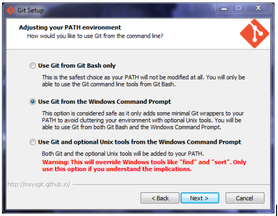
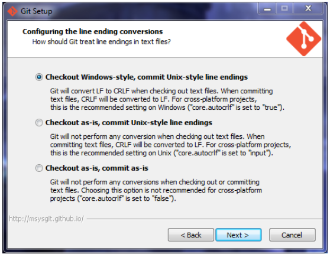

#Intro to using Git, Python, and Leaflet
This talk is an introduction to some popular tools for doing GIS-related 
development: Git (version control), Python (programming) and Leaflet 
(a web mapping library). Even if you're not a developer, these tools 
are very accessible and it never hurts to add some new tools to your toolbelt. 
After a brief introduction to Git, Python, and Leaflet, we'll put them all to 
use by building a simple web mapping application. This will be an interactive 
tutorial, so bringing your laptop and following along is encouraged, but not 
required. If you want to follow along, please follow the instructions below 
to install Git and Python for your operating system. We'll spend a few minutes 
during the talk on this, but time is limited so it would be awesome if you 
come ready to go! 

#Installation Instructions
##Installing Python
If you're on Windows or Mac OS X, download and install Python 3.4 from [https://www.python.org/downloads/release/python-343/](https://www.python.org/downloads/release/python-343/) 
for your platform. If you're using Linux, Python 3.4 is most likely already 
installed.

##Installing Git
Though there are Git GUIs available, we're going to use the command line since 
is the same on all platforms. Visit [http://git-scm.com//download](http://git-scm.com//download) 
and download Git for your platform. If you're using Mac OS X or Linux, you're done.

###Installing Git on Windows
The git installer on Windows asks a few questions during the installation so 
that it is compatible with Unix-style line endings and so that the git tools 
can be accessed from the Windows command prompt.

Run the installer like normal. When you reach __Adjusting your PATH environment__, 
select __Use Git from the Windows Command Prompt__. 

Continue with the installer until you reach __Configuring the line ending conversions__. 
Select __Checkout Windows-style, commit Unix-style line endings__. Finish the 
installation and you'll be set. 

